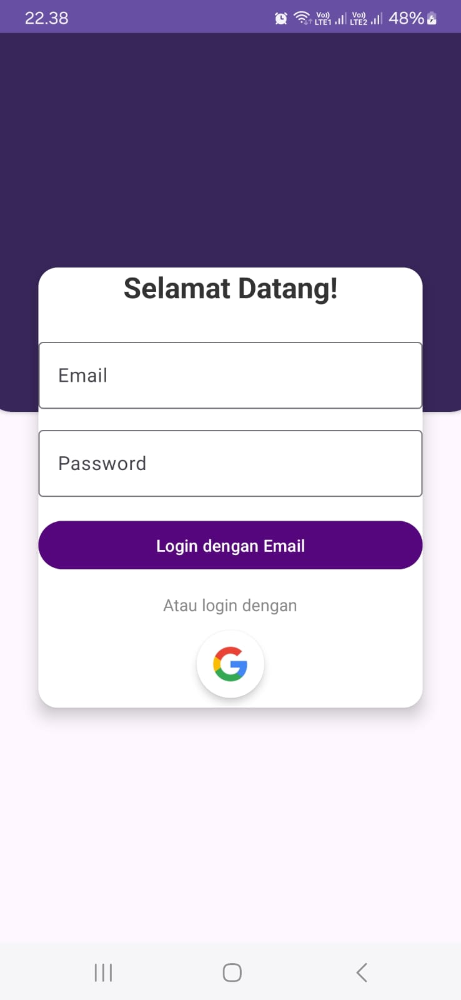
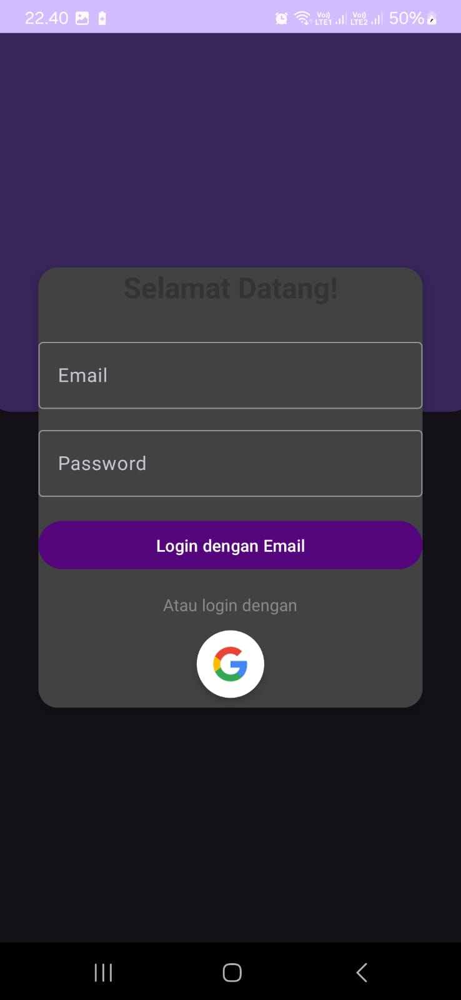
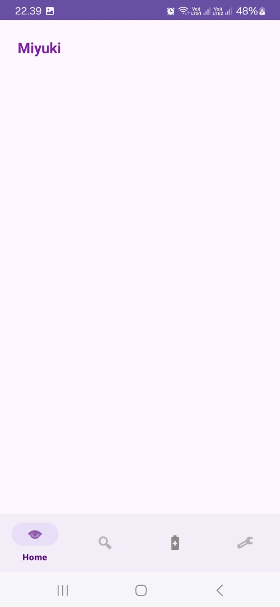
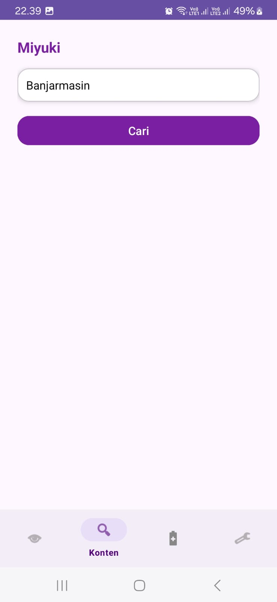
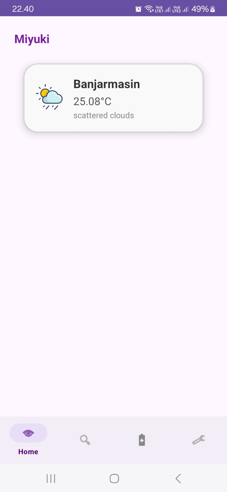
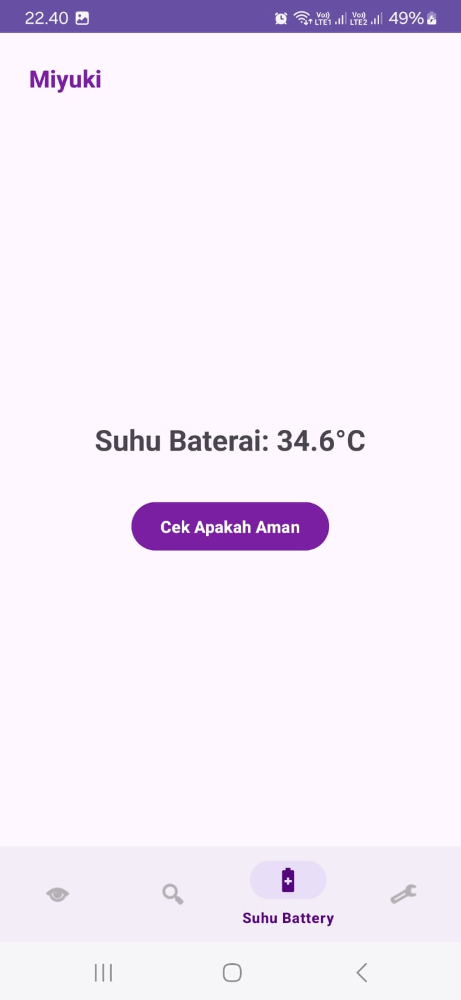
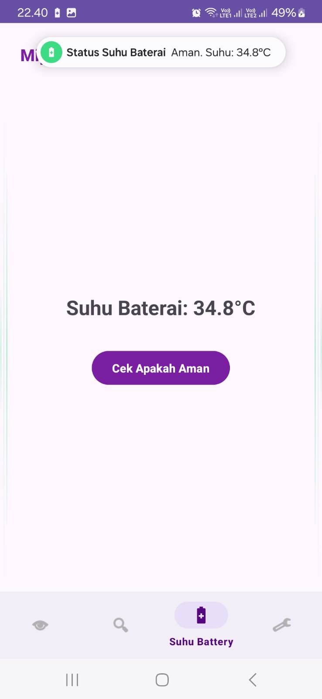
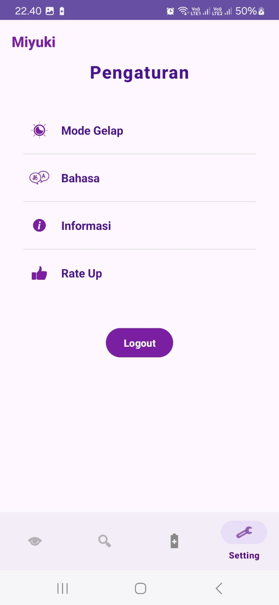
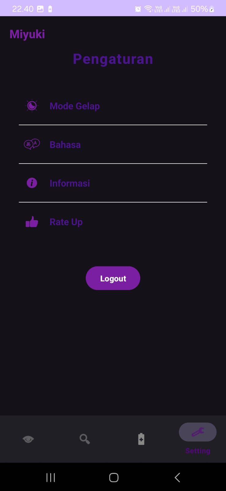

<h1 align="center">📱 Miyuki – Weather & Battery App</h1>

  Aplikasi cuaca & suhu baterai cerdas, elegan, dan modern.  

  
  
  
  

---

## ✨ Tentang Miyuki

**Miyuki** adalah aplikasi mobile berbasis Android yang menggabungkan informasi **cuaca terkini** dengan **monitoring suhu baterai** perangkat. Dirancang menggunakan **Jetpack Compose** dan **Firebase**, Miyuki hadir dengan desain elegan, performa ringan, dan pengalaman pengguna yang intuitif. Cocok untuk pengguna aktif yang peduli terhadap kondisi perangkat dan cuaca sekitar. ☁️🔋

---

## 🚀 Fitur Unggulan

- 🔐 **Autentikasi Aman**
  - Masuk menggunakan **Google Sign-In** atau **Email & Password** melalui Firebase Authentication.

- ☀️ **Cuaca Real-Time**
  - Cari cuaca kota mana pun melalui API OpenWeatherMap.
  - Simpan hasil pencarian & tampilkan di halaman Home.
  - Swipe lama untuk **hapus** data cuaca.

- 🌡️ **Pantau Suhu Baterai**
  - Tampilkan suhu baterai secara real-time.
  - Tekan tombol **"Cek Apakah Aman"** untuk menerima notifikasi status suhu.

- 🎨 **Tema Gelap & Terang**
  - Sesuaikan tampilan sesuai preferensi dengan toggle mode terang/gelap.

- 🌍 **(Segera) Dukungan Multi-Bahasa**
  - UI siap untuk mendukung berbagai bahasa – tinggal tambahkan string XML.

- ℹ️ **Pengaturan Lengkap**
  - Menu informasi developer, rate up, dan logout dari akun.

---

## 📸 Tangkapan Layar

| Login Light | Login Dark |
|------------|------------|
|  |  |

| Home | Cari Cuaca |
|------|------------|
|  |  |

| Cuaca Tersimpan | Suhu Baterai Aman |
|----------------|-------------------|
|  |  |

| Notifikasi Baterai | Setting Light | Setting Dark |
|--------------------|---------------|--------------|
|  |  |  |

---

## 🧠 Teknologi yang Digunakan

| Tools / Frameworks | Keterangan |
|--------------------|------------|
| 🔧 **Jetpack Compose** | UI deklaratif Android modern |
| 🔥 **Firebase Auth** | Autentikasi user Google & Email |
| 📡 **OpenWeatherMap API** | Data cuaca global |
| 💾 **Room / Firebase** | Penyimpanan data cuaca |
| 🛠️ **Material Design 3** | Tampilan modern & elegan |
